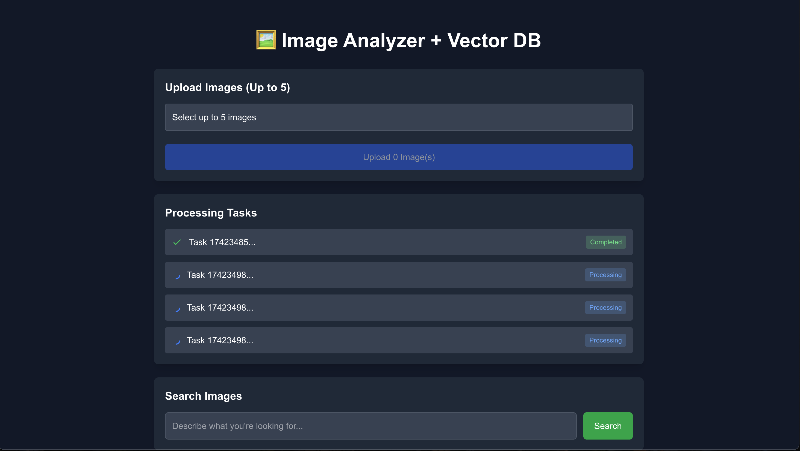

# Go Image Vector

A Go application that allows you to search for images using natural language queries, leveraging AI for image understanding and vector embeddings for semantic search.



## Features

- Upload images and extract text descriptions using AI
- Generate vector embeddings from text descriptions
- Search for images using natural language queries
- Vector similarity search powered by PostgreSQL pgvector

## Prerequisites

- Go 1.24+
- PostgreSQL with pgvector extension
- Ollama running locally with the required models:
  - llava/gemma3
  - nomic-embed-text

## Installation

1. Clone the repository

```bash
git clone https://github.com/pablobfonseca/go-image-vector.git
cd go-image-vector
```

2. Install Go dependencies

```bash
go mod download
```

3. Set up PostgreSQL with pgvector

```sql
CREATE EXTENSION vector;
```

4. Create a `.env` file with your database configuration

```
DB_HOST=localhost
DB_USER=postgres
DB_PASSWORD=your_password
DB_NAME=image_vector
DB_PORT=5432
MODEL=gemma3
```

5. Install and start Ollama with the required models

```bash
ollama pull llava # or gemma3
ollama pull nomic-embed-text
```

## Running the Application

1. Start the Go server

```bash
go run main.go
```

2. For client development, navigate to the client directory

```bash
cd client
npm install
npm run dev
```

3. Access the application at http://localhost:3000

## API Endpoints

- `POST /upload` - Upload and process an image
- `POST /search` - Search for similar images using text queries
- `/uploads/` - Static file serving for uploaded images

## How It Works

1. **Image Upload**: Images are uploaded and stored in the `uploads` directory
2. **Text Extraction**: The llava model analyzes the image to extract descriptive text
3. **Vector Embedding**: The nomic-embed-text model converts the text to a vector embedding
4. **Storage**: The image path, description, and vector are stored in PostgreSQL
5. **Search**: Text queries are converted to vectors and compared against stored embeddings using cosine similarity

## License

MIT
